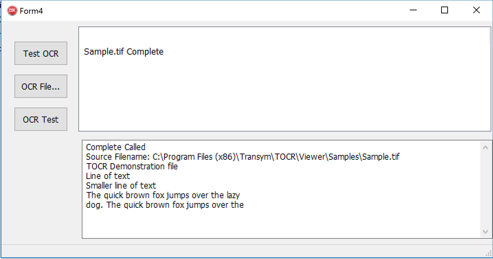

# DelphiTransymOCR
Delphi Component and Demo using Transym OCR
http://www.transym.com/

This is an open-source non-visual Delphi component, to be used in combination with the commercial Transym OCR SDK. 
The component uses a separate thread to enable the UI to remain responsive throughout the entire optical character recognition processing step.  The component also allows multiple files to be queued for processing.

The Transym OCR SDK supports the Windows 32-bit and 64-bit platforms and this component supports both as well.

Geoffrey Smith

http://www.tysontechnology.com.au

Delphinus-Support has recently been added.
